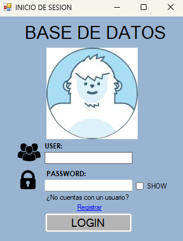

# 🗄️ Control de Bases de Datos SQL Server (ProyectoTBD)

Una aplicación de escritorio desarrollada en **C# (Windows Forms)** diseñada para facilitar la administración y gestión de bases de datos en Microsoft SQL Server. Permite a los usuarios interactuar con el servidor de base de datos de manera visual sin necesidad de escribir comandos SQL complejos manualmente.

---

## 📋 Características Principales

### 🔐 Autenticación y Seguridad
* **Inicio de Sesión (Login):** Conexión segura utilizando autenticación de SQL Server.
* **Animación Interactiva:** El formulario de login incluye una animación visual que reacciona a la longitud del texto ingresado y al campo seleccionado.
* **Gestión de Contraseñas:** Opción para visualizar u ocultar la contraseña.

### 👤 Gestión de Usuarios (Register)
* **Creación de Logins:** Permite registrar nuevos usuarios en el servidor SQL.
* **Asignación de Roles:** Asigna automáticamente roles de `db_datareader`, `db_datawriter` y `db_owner` a las bases de datos seleccionadas.
* **Validación de Seguridad:** Verifica que las contraseñas cumplan con requisitos de complejidad (Mayúsculas, números, caracteres especiales) usando **Regex**.

### 🛠️ Gestión de Estructura de Base de Datos (DDL)
* **Explorador de Esquema:**
    * Visualización de todas las bases de datos del servidor (filtrando las del sistema).
    * Listado de tablas pertenecientes a una base de datos seleccionada.
    * Detalle de columnas, tipos de datos, longitud máxima, nulabilidad y constraints (PK, FK, Unique).
* **Creación de Tablas:** Interfaz gráfica para definir columnas y crear nuevas tablas dinámicamente.
* **Modificación de Tablas:**
    * *Agregar Campos:* Añadir nuevas columnas a tablas existentes.
    * *Eliminar Campos:* Borrar columnas de una tabla seleccionada.

---

## 📸 Galería: Animación Interactiva (Login)

El sistema cuenta con un personaje animado que reacciona a las acciones del usuario para mejorar la experiencia visual:

| Estado | Captura de Pantalla | Descripción |
|:---:|:---:|:---|
| **Normal** |  | Estado inicial al abrir la aplicación. El personaje espera la interacción. |
| **Escribiendo Usuario** |  | Al escribir el usuario, el personaje sigue la longitud del texto con la mirada. |
| **Ingresando Contraseña** |  | Al seleccionar el campo de contraseña, el personaje se cubre los ojos por privacidad. |
| **Visualizar Contraseña** |  | Si el usuario activa "SHOW", el personaje espía o cambia su estado. |

---

## 🚀 Requisitos del Sistema

Para ejecutar o compilar este proyecto, necesitas:

* **Sistema Operativo:** Windows 10 u 11.
* **IDE:** Visual Studio 2019 o 2022.
* **Framework:** .NET Framework 4.7.2.
* **Base de Datos:** Microsoft SQL Server (Instancia Local).

---

## 🔧 Instalación y Ejecución

1.  **Clonar el repositorio:**
    ```bash
    git clone [https://github.com/tu-usuario/control-bases-de-datos-sqlserver.git](https://github.com/tu-usuario/control-bases-de-datos-sqlserver.git)
    ```

2.  **Abrir la solución:**
    * Navega a la carpeta y abre el archivo `ProyectoTBD.sln` con Visual Studio.

3.  **Configuración de Base de Datos:**
    * Asegúrate de tener una instancia de SQL Server corriendo en `localhost`.

4.  **Compilar y Ejecutar:**
    * Presiona `F5` o el botón de **"Iniciar"** en Visual Studio.

---

## 🏗️ Arquitectura del Proyecto

La solución está dividida en dos proyectos principales para mantener una separación de responsabilidades:

1.  **ProyectoTBD (Capa de Presentación):**
    * Contiene los formularios (`Login`, `Register`, `Form1`).
    * Maneja la interacción con el usuario y validaciones visuales.

2.  **SQLConn (Capa de Datos):**
    * Librería de clases (`.dll`) que encapsula la lógica de conexión con SQL Server via `System.Data.SqlClient`.
    * Métodos para ejecutar queries DDL (`Create`, `Alter`, `Drop`) y consultas de metadatos (`INFORMATION_SCHEMA`).

---

## ✒️ Autor

* **Carlos Ariel Cuadras Camacho**

---

## 📄 Licencia

Este proyecto está bajo la Licencia MIT.
